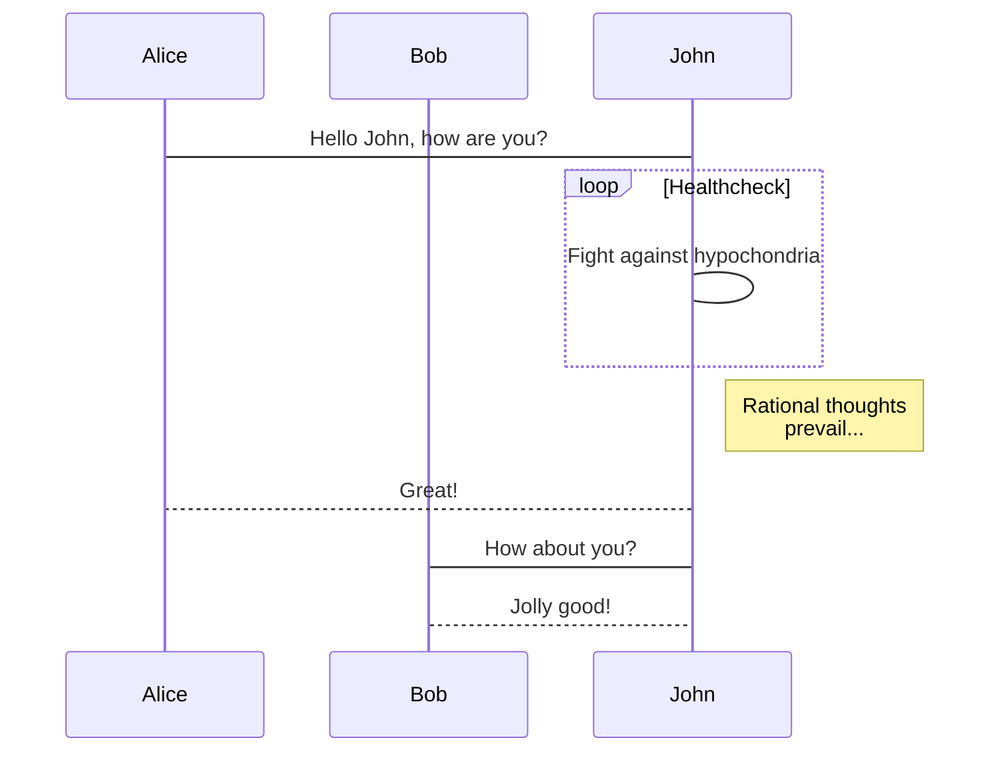
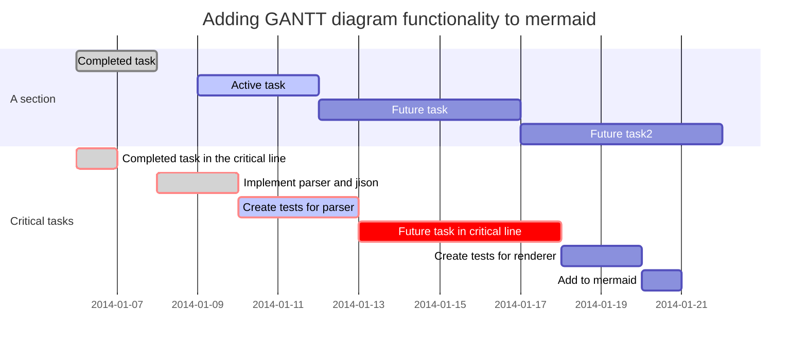

# Filing Expenses 2

To get reimbursed for your expenses, just fill in our simple form and we'll get it approved!


**Good to know:** you can   public links, like this Typeform, to make data capture a breeze!



 

https://2w3pnm4iy73.typeform.com/to/e51Urcwb


### An example of a flowchart

### An example of a sequence diagram

### An example of a gantt diagram

Play with mermaid using this [live editor][live-editor].