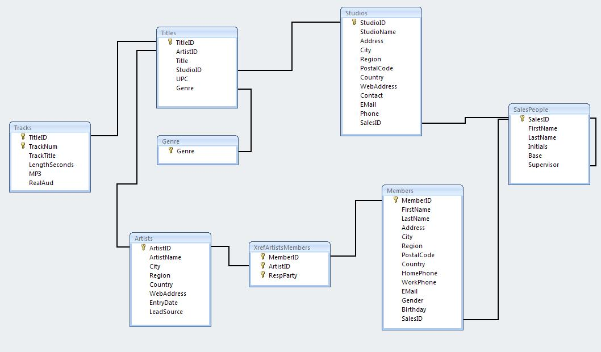

# LyricDB SQL

#### Set up environment

Download [MySQL](http://dev.mysql.com/doc/refman/5.7/en/windows-installation.html#windows-installation-simple), [Azure Data Studio](https://docs.microsoft.com/en-us/sql/azure-data-studio/download-azure-data-studio?view=sql-server-ver16) or Postgres in [Supabase](https://supabase.com/)

> If you are using lab computers, just go to next step.

Start MySQL workbench.

> Addition on the MySQL server setup

This is a mock data set of relationships of artists, bands, recording studios and songs. I've included two files one sql and txt file of the mock dataset.&#x20;

## ERD diagram of Lyric mock data




