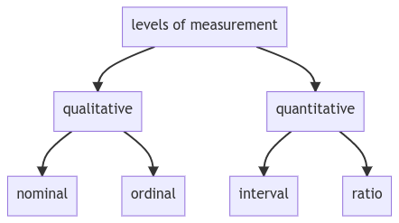

# Levels of measurement

Another classification of data is known as levels of measurement.


**levels of measurement:** A way to classify data. There are two levels of measurement - qualitative and quantitative, which are further classed into nominal & ordinal, and ratio & interval, respectively.




<details>

<summary>mermaid syntax</summary>

```

graph TD
    A[levels of measurement] --> B[qualitative];
    A[levels of measurement] --> D[quantitative];
    B[qualitative] --> C[nominal];
    B[qualitative] --> F[ordinal];
    D[quantitative] --> E[interval];
    D[quantitative] --> G[ratio];
```

</details>

Qualitative data can be nominal or ordinal.


**qualitative data:** A subgroup of levels of measurement. There are two types of qualitative data - nominal and ordinal.


Nominal variables are like the categories like car brands or the four seasons – winter, spring, summer and autumn. They aren’t numbers and cannot be ordered. Ordinal data consists of groups and categories which follow a strict order.


**nominal:** Refers to variables that describe different categories and cannot be put in any order.


Ordinal data consists of groups and categories which follow a strict order.

Imagine you have been asked to rate your lunch and the options are: disgusting, unappetizing, neutral, tasty, and delicious. These preferences are ordered from negative to positive, thus the level of measurement is qualitative, ordinal.


**ordinal:** Refers to variables that describe different categories, but can be ordered.


Quantitative variables split into two groups: interval and ratio.

Intervals and ratios are both represented by numbers but have one major difference.

Ratios have a true zero and intervals don’t. Most things we observe in the real world are ratios. Their name comes from the fact that they can represent ratios of things.


**quantitative data:** A subgroup of levels of measurement. There are two types of quantitative data - ratio and interval.



**ratio:** A number that has a unique and unambiguous zero point, no matter if a whole number or a fraction (has a true zero)


If I have 2 apples and you have 6 apples, you would have 3 times as many as I do. The ratio of 6 and 2 is 3.



**interval:** An interval variable represents a number or an interval. There isn't a unique and unambiguous zero point. For example, degrees in Celsius and Fahrenheit are interval variables, while Kelvin is a ratio variable. (doesn't have a true zero)


Today is 5 degree Celsius or 41 degree Fahrenheit and yesterday was 10 degree Celsius or 50 degree Fahrenheit. Yesterday would be two times colder in Celsius but not in Fahrenheit. Its because they don't have true zeroes.

Temperature in Celsius and 0 levels Fahrenheit aren't authentic zeroes. Kelvins have authentic zeroes. zero levels Kelvin is the temperature at which atoms stop moving and nothing can be colder than 0 degrees Kelvin. This equals -273.15 degrees Celsius, or -459.67

Numbers like 2, 3, 10, 10.5, Pi, etc. can be both interval or ratio, but you have to be careful with the context you are operating in.

