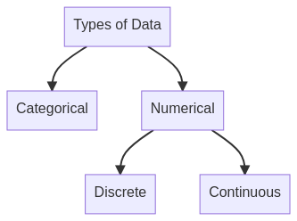

# Types of Data


**Types of data:** A way to classify data. There are two types of data - categorical and numerical.




<details>

<summary>Mermaid syntax</summary>

```
graph TD
    A[Types of Data] --> B[Categorical]
    A[Types of Data]  --> C[Numerical]
    C[Numerical] --> D[Discrete]
    C[Numerical] --> E[Continuous] 
```

</details>

There is categorical and numerical data, categorical data describes categories or groups. Instances of questions that answers to yes and no questions are categorical questions.


**categorical data:** A subgroup of types of data. Describes categories or groups.


```
Graphs and tables for categorical variables							
				
	    Frequency	     Relative frequency		
Audi	       124	          37%		
BMW	       98	          29%		
Mercedes       113	          34%		
Total	       335	         100%		
									
				
Ordered	    Frequency	   Relative frequency	  Cumulative frequency	
Audi	      124	           37%                     37%	
Mercedes      113                  34%                     71%	
BMW	      98                   29%                     100%	
				
```


**numerical data:** A subgroup of types of data. Represents numbers. Can be further classified into discrete and continuous.


Numerical data represents numbers divided into two subsets, discrete and continuous. Discrete data can usually be counted in a finite matter such as integer numbers such as number of children/family members or SAT score.


**discrete data:** Data that can be counted in a finite matter. Opposite of continuous


Continuous data is infinite and impossible to count. Your exact weight can take on every value in some range. Height, area, distance, and time are some continuous data examples. They all can vary by infinite smaller amounts


**continuous data:** Data that is 'infinite' and impossible to count. Opposite of discrete.



**representative sample:** A sample taken from the population to reflect the population as a whole



**variable:** A characteristic of a unit which may assume more than one value. Eg. height, occupation, age etc.



## &#x20;<a href="#class-diagrams" id="class-diagrams"></a>

